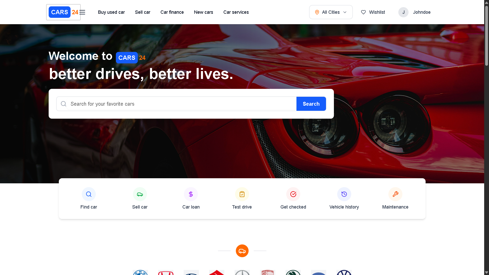

# 🚗 Cars24 — Intelligent Used Car Marketplace

A modern full-stack web application for buying, selling, and managing used cars with intelligent pricing, maintenance insights, geo-location filtering, notifications, and referral rewards.

🌐 **Live Demo**  
https://cars24-teal.vercel.app

---

# 📌 Overview

Cars24 is a full-stack automotive marketplace platform that enables users to:

- Browse and search used cars
- Filter vehicles by specifications and location
- View intelligent price recommendations
- Estimate maintenance costs
- Book inspections or purchases
- Receive real-time notifications
- Earn referral rewards via wallet system

The system integrates intelligent decision-support tools to improve vehicle discovery, pricing transparency, and ownership awareness.

---

# ⚡ Local Setup

## Prerequisites

- Node.js  
- .NET SDK  
- MongoDB (running locally)  
- Git  

Ensure MongoDB is running at:

mongodb://localhost:27017

---

## ▶️ Run Backend

cd backend/Cars24API  
dotnet run  

Backend runs on:  
http://localhost:5203  

---

## ▶️ Run Frontend

cd frontend/cars24  
npm install  
npm run dev  

Frontend runs on:  
http://localhost:3000  

Open in browser:  
http://localhost:3000  

---

# 🏗️ Architecture

User Browser (Frontend)  
        ↓  
   Next.js Application  
        ↓ HTTP API  
   ASP.NET Core Backend  
        ↓  
      MongoDB  

- Frontend: UI, interactions, client logic  
- Backend: API, business logic, database access  
- Database: vehicle, user, booking, wallet data  

---

# 📁 Project Structure

```
Cars24/
├── README.md
├── add_sample_cars.bat
├── cars24.sln
│
├── backend/
│   └── Cars24API/
│       ├── appsettings.json
│       ├── appsettings.example.json
│       ├── Cars24API.csproj
│       ├── Dockerfile
│       ├── Program.cs
│       ├── Controllers/        # API endpoints
│       ├── Models/             # Data models
│       ├── Services/           # Business logic
│       ├── Properties/
│       ├── bin/
│       └── obj/
│
├── frontend/
│   └── cars24/
│       ├── package.json
│       ├── tsconfig.json
│       ├── next.config.ts
│       ├── .env.local
│       ├── public/             # Static assets
│       └── src/
│           ├── pages/          # Application pages
│           ├── components/     # UI components
│           ├── lib/            # Utilities & helpers
│           ├── context/        # Global state
│           ├── services/       # API services
│           ├── styles/         # Styling
│           └── utils/          # Helpers
```


# 🌟 Key Features

## 🚗 Vehicle Marketplace
- Browse available cars with specifications  
- View images, price, and location  
- Book vehicle inspections or purchases  
- Dynamic listing updates  

---

## 🔎 Advanced Search & Filtering
- Predictive search suggestions  
- Fuzzy brand matching  
- Filters: fuel, year, mileage, transmission  
- Relevance-based results  

---

## 📍 Geo-Location Filtering
- City-based vehicle listings  
- Location selector integration  
- Region-specific availability  
- Practical purchase relevance  

---

## 💲 Dynamic Pricing Engine
Intelligent price recommendation based on:

- Region (Metro / Rural / Hilly)  
- Season (Monsoon / Summer / Winter)  
- Vehicle type (SUV / Hatchback / Sedan)  

Displays:

- Base Price  
- Recommended Price  
- Adjustment reason  

Example:  
SUV demand increases in hilly regions during monsoon  

---

## 🛠️ Maintenance Cost Calculator
Predicts ownership cost using:

- Vehicle age  
- Kilometers driven  
- Brand service cost patterns  

Outputs:

- Maintenance level (Low / Medium / High)  
- Estimated service cost  
- Upcoming maintenance insight  

---

## 🔔 Real-Time Notifications
Browser-based notifications for:

- Booking confirmation  
- Price updates  
- Marketplace events  
- System alerts  

Triggered automatically by user actions.

---

## 🎁 Referral & Wallet Reward System
- Unique referral codes  
- Reward after successful booking/sale  
- Points credited to both users  
- Wallet balance tracking  
- Engagement incentive mechanism  

---

# 📚 Technology Stack

Layer: Frontend — Next.js, React, Tailwind CSS  
Layer: Backend — ASP.NET Core (C#)  
Layer: Database — MongoDB  
Layer: Notifications — Browser Notifications  
Layer: Deployment — Vercel + Render  

---

# 🚀 Deployment

Frontend deployed on: Vercel  
Backend deployed on: Render  

Environment variables configure API connection and database access.

---

# 📸 Screenshots

## Home Page  



## Vehicle Listing  


## Car Details & Pricing  


## Wallet & Referral  


---

# 👤 Author

Harsh Moradiya  
Full-Stack Developer  
MscIT Student  

---

# 📄 License

This project was developed for academic and internship purposes.
